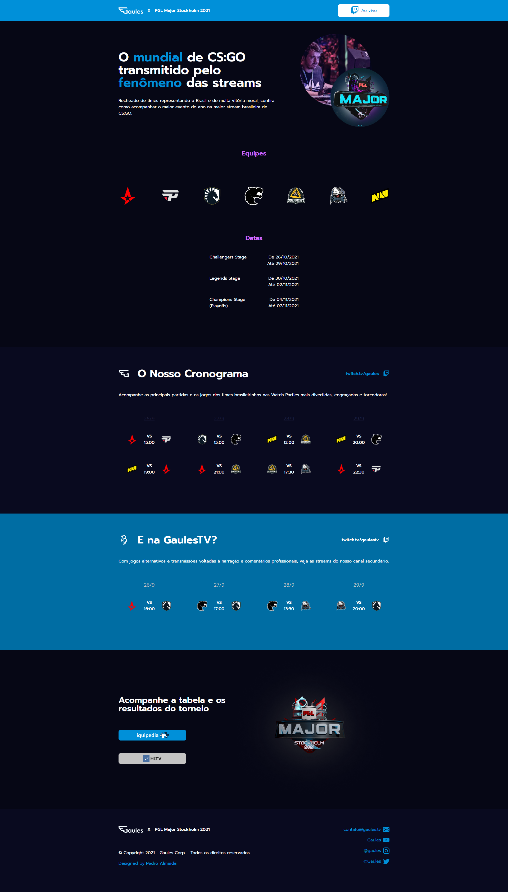

<h1 align="center">Landing Page | Gaules x Stockholm CSGO Major</h1>

<br>



<br>

<p align="center">Trying to study and improve my skills as a front-end developer and as a Ui Designer, I created this fictional landing page from a concept of a website to promote the online CS:GO major tournament broadcasts made by the streamer @Gaules and his Gaules Corporation. The site was created and thought from the interface design, to the implementation with ReactJS + Styled Components and using GraphCMS as Content Management System and graphql-request api for data consumption."</p>

<br>

## **About The Project**

The website's idea is to show a little bit about the championship and also publicize the streams schedule.

Thinking about a real use case and even to study how the structures and tools of GraphCMS work, the dynamic information of the site was structured in a Schema with Game Days, Matches and Teams models. 

In this way, the data can be consumed to form the area of the page that presents the teams and also to form the match schedules, organized by days and showing the times and teams for each match.


<br>

### Built With:

- []()JavaScript
- []()HTML5
- []()ReactJS(create-react-app)
- []()Styled Components
- []()GraphCMS

   <br>

## **Getting Started**

To get a local copy up and running follow these simple steps.

### Prerequisites

This is an example of how to list things you need to use the software and how to install them.

- npm
  ```sh
  npm install npm@latest -g
  ```

### Installation

1. Clone the repo
   ```sh
   git clone https://github.com/github_username/repo_name.git
   ```
2. Install NPM packages
   ```sh
   npm install
   ```
   ```sh
   yarn
   ```

<br>

### Running locally
```sh
   npm run dev
```
```sh
   yarn dev
```
<br>

## License

Distributed under the Creative Commons Legal Code. See `LICENSE` for more information.

## Contact

Pedro Almeida - pedroalmeid@ignos.com.br
